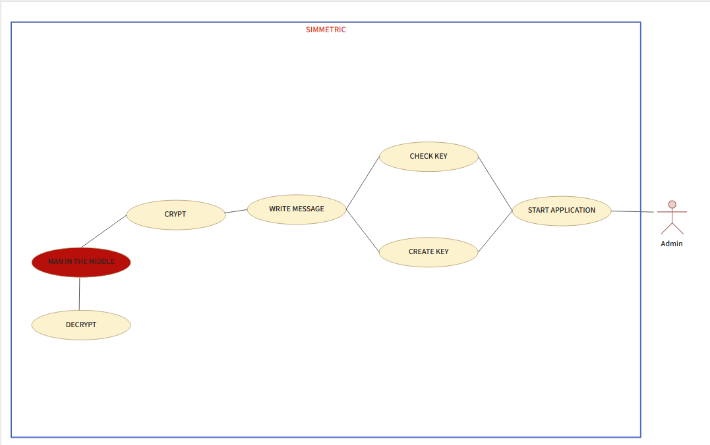
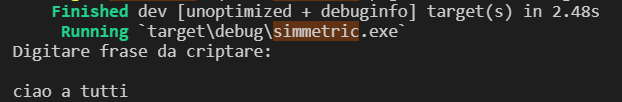
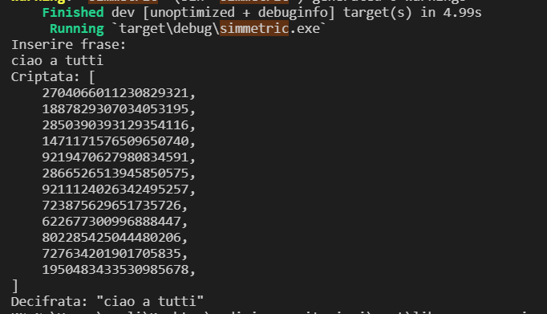

# Try_To_Hack_My_Cipher
***This is a program that encrypts and decrypts with a map and allows you not to be exposed to frequency and salt attacks.***
***Tries to break the encryption assuming it doesn't know the given map and vector***

# How does it work
***this rust program encrypts and decrypts with symmetric encryption using a keymap.***

***The text must be a maximum of 256 characters long for the algorithm to remain secure.***

***We publish the project as a challenge and welcome feedback on vulnerabilities at: u.calice@studenti.poliba.it***

***because for this implementation we have not used any known encryption algorithm and there are no mathematical rules to regulate its operation***

# How to use
***When we start the program for the first time we should change the source code with the correct instruction situated in:***
***readme.txt***
***after we can see the follow output:***

***This step create two files in src/ named: array.json and map.json***

***Now i can crypt and decript the plain text with the json map, as here:***

# Challenge

***The vector is the ciphertext from which to start hacking this rust program.***
***The challenge is to find a practical or theoretical way to define the use of this algorithm as unsafe***
***Once the challenge is completed, send the answer to:***
***u.calice@studenti.pliba.it***
***Thanks for your attention, see you soon, Insidbyte***
